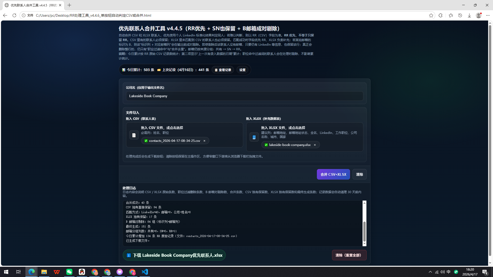
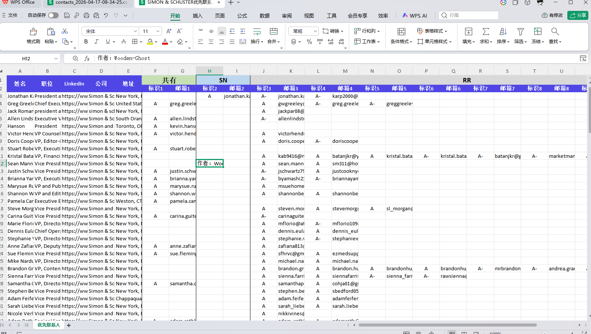
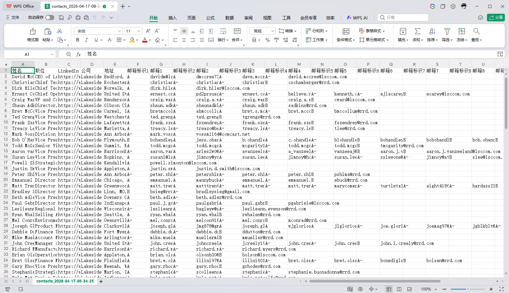
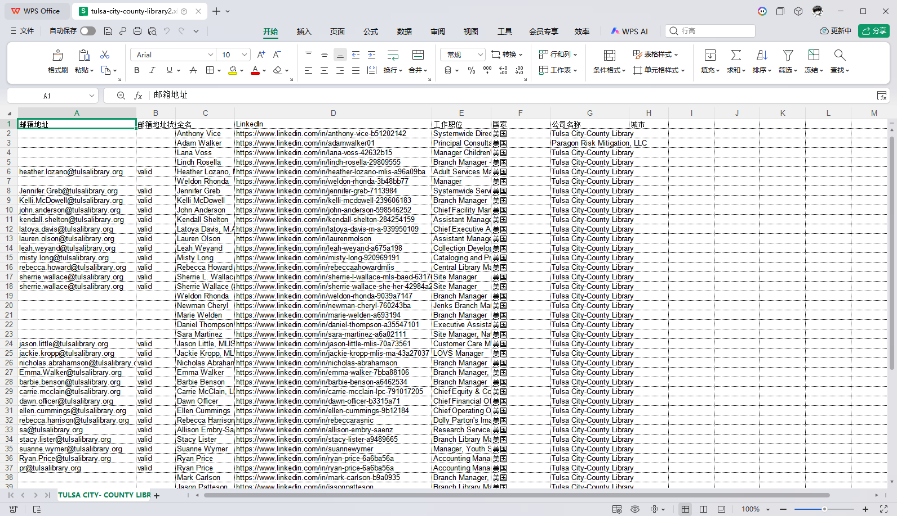

# RR Contact Merge Tool  
## 优先联系人合并工具

一个用于**联系人数据清洗与合并**的浏览器端小工具。  
适用于将 **RR 导出的 CSV 联系人表** 与 **SN/补充来源的 XLSX 数据表** 自动合并，输出结构化、可直接交付的联系人 Excel 文件。

---

## 项目简介

这个工具并不是简单地“把两个表拼起来”，而是针对实际业务场景设计的联系人处理工具，核心目标是：

- 保留 RR 主数据的优先级
- 自动识别同一联系人
- 补充 SN/XLSX 中可用的信息
- 按业务规则剔除无效邮箱
- 最终输出结构清晰、便于交付和继续处理的 Excel 文件

本项目适合展示以下能力：

- 前端单文件工具开发
- 业务规则落地
- 异构表格数据适配
- 数据清洗与去重逻辑设计
- 面向交付场景的工具化能力

---

## 效果预览

### 1. 主界面


### 2. 处理结果


---

## 需求背景

这个工具来自真实业务型需求，不是为了演示而写的“练手小脚本”。  
它解决的是：**两个来源、两种结构、不同字段风格的联系人数据，如何在保留主数据优先级的前提下完成自动合并与清洗。**

### 需求说明 A


### 需求说明 B


---

## 核心功能

### 1. 支持两种处理模式
- **CSV 单独处理**
- **CSV + XLSX 联合合并**

### 2. 自动识别同一联系人
优先级如下：

1. 标准化 LinkedIn
2. 邮箱
3. 公司 + 姓名

### 3. RR 优先，但不是只保留 RR
- CSV（RR）中已有联系人必须保留
- XLSX 中未匹配到 CSV 的联系人也会保留
- 匹配成功后，字段以 RR 为主，XLSX 负责补充

### 4. B 标识邮箱自动剔除
若邮箱标识为 **B**，则会在输出前将：

- 对应“标识列”
- 对应“邮箱列”

成对删除。

注意：  
这是**删邮箱对，不是删整行联系人**。  
即使某联系人剔除 B 邮箱后没有邮箱，只要仍有 LinkedIn、姓名、公司、职位等有效信息，也会被保留。

### 5. 职位过滤
支持通过关键词过滤职位，例如：

- IT Manager
- HR Executive
- HR Manager
- assistant

命中过滤关键词的联系人会被直接排除。

### 6. 输出结构清晰
输出 Excel 会按邮箱来源进行分组展示：

- 共有
- SN
- RR

并保留格式、分组、表头样式，方便后续人工查看与继续处理。

### 7. 处理日志与记录统计
页面会显示：

- CSV 原始记录数
- XLSX 原始记录数
- 职位过滤删除数
- 合并成功数
- CSV 独有保留数
- XLSX 独有保留数
- B 邮箱对剔除数
- 最终生成数

同时还会保留最近处理记录，便于回看。

---

## 输入文件说明

本项目特意保留了**两种表头明显不同的示例输入文件**，用于体现工具对异构数据的适配能力。

### RR 输入文件（CSV）
示例文件：
```text
examples/01_input_rr_contacts.csv
